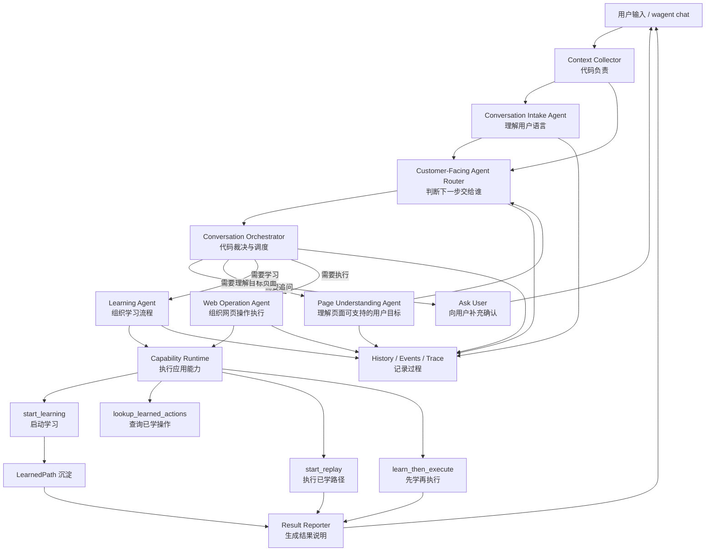

# Technical Design

状态：proposed（docs generated, implementation not started）

## 目标架构



早期实现可以仍放在 `apps/api/app/services/conversation/` 下，不要求一次拆成多个
运行时包。但产品角色必须分开，trace / provenance 也必须能区分。

## 新增 / 调整模块

### ConversationContextCollector

建议位置：

```text
apps/api/app/services/conversation/context.py
```

职责：

- 收集最近 N 轮 user / agent messages。
- 收集 `pending_intake`、新增 `pending_target`、`last_no_path_reason`。
- 收集 current-session `learned_actions`，按 `target_url` / `site_origin` 分组。
- 收集最近显式 URL、最近 no-path target。
- 输出 redacted context bundle 给 Intake / Router。

不得把 sensitive slot 明文写入持久化 metadata；运行时需要的 sensitive value 继续走
M11.3.4 的 runtime-only cache 规则。

### CustomerFacingAgentRouterService

建议位置：

```text
apps/api/app/services/conversation/router_agent.py
apps/api/app/schemas/conversation_router.py
```

职责：

- 读取 Intake result、context bundle、learned action summary、可选 page understanding。
- 输出 `RouteDecision` schema。
- provider 未配置时可 deterministic fallback。
- malformed JSON / schema invalid / low confidence 时不得触发 learning / replay。

Router 不直接调用 capability。Router 只返回建议给 Orchestrator。

### CapabilityRegistry / CapabilityRuntime

建议位置：

```text
apps/api/app/services/conversation/capabilities.py
```

职责：

- 定义 capability 名称、输入 schema、输出 schema、preconditions、risk hints。
- 由 Orchestrator 调用。
- 封装现有 service：LearningRunService、Replay hook、LearnedPathRepository、
  page inspection / AST / PageAnalysis 组合。

第一版 capability 可以是轻量函数注册表，不需要引入复杂工具框架。

### PageContextBuilder

建议位置：

```text
apps/api/app/services/conversation/page_context.py
```

复用：

- `ExecutionRuntime.current_html()` / `current_title()` / `current_url()`
- `html_ast_parser.parse_html`
- `ast_simplifier.simplify_ast`
- `PageAnalyzer.analyze`
- `page_signature` helpers

第一版输入可以是显式 URL。M11.3.5 不实现 active browser tab。

### PageUnderstandingService

建议位置：

```text
apps/api/app/services/conversation/page_understanding.py
apps/api/app/schemas/page_understanding.py
```

职责：

- 读取 page context bundle。
- 输出页面类型、supported goals、required slots、risk hints、confidence。
- 不输出 selector、DOM path、browser steps、learned_path_id。

实现可先使用 fake / deterministic provider，真实 LLM smoke 后才能声称 Page Understanding
LLM acceptance passed。

### LearningAgentRuntime

建议位置：

```text
apps/api/app/services/conversation/learning_agent.py
```

职责：

- 组织学习请求：target、goal、slots、page understanding、risk hint。
- 请求 Orchestrator / CapabilityRuntime 调用 `start_learning`。
- 解释 learning result 给 Result Reporter。

它不是当前 autonomous explorer 的 Supervisor。Supervisor 只评价学习 run 的结果；Learning
Agent 负责面客流程层的“是否该学、学什么、缺什么”组织。

### WebOperationAgentRuntime

建议位置：

```text
apps/api/app/services/conversation/web_operation_agent.py
```

职责：

- 查询 learned actions。
- 根据 target scope 和 user goal 请求 `start_replay` 或 `learn_then_execute`。
- 不从原始页面发明执行步骤。
- 不跨站点命中历史 LearnedPath。

### Prompt Asset Loader

建议位置：

```text
apps/api/app/prompts/
apps/api/app/services/conversation/prompt_assets.py
```

Prompt 文件目录：

```text
apps/api/app/prompts/
  README.md
  registry.toml
  shared/
    webagentflow_boundaries.md
    evidence_and_scope.md
    redaction_rules.md
    structured_output_rules.md
  agents/
    conversation_intake_agent/
      prompt.md
      metadata.toml
    customer_facing_agent_router/
      prompt.md
      metadata.toml
    page_understanding_agent/
      prompt.md
      metadata.toml
    learning_agent/
      prompt.md
      metadata.toml
    web_operation_agent/
      prompt.md
      metadata.toml
    task_result_reporter/
      prompt.md
      metadata.toml
```

实现要求：

- `prompt_assets.py` 提供只读 loader，按 prompt id 和 version 加载 prompt。
- `registry.toml` 记录当前启用的 prompt id、version、agent role、schema name、
  runtime policy 和文件 hash。
- `metadata.toml` 记录单个 Agent prompt 的用途、输入边界、禁止输出、schema 名称和
  sensitive context policy。
- service 代码不得内嵌大段 prompt。允许硬编码 prompt id 常量，但不允许把 prompt body
  写在 service 函数里。
- shared fragments 必须通用，不得包含测试页面、固定账号、固定按钮、固定 URL 或固定站点。
- loader 组合 prompt 时应固定顺序：shared boundaries -> shared evidence/scope ->
  shared redaction -> shared structured output -> agent prompt -> runtime context。
- runtime context 由代码动态注入，prompt asset 本身不得包含 live session 数据。
- LLM trace 记录 `prompt_id`、`prompt_version`、`prompt_sha256`、`schema_name`、
  `schema_version`、provider、model、request id 和 redaction 状态。
- prompt 缺失、hash 不匹配、metadata 缺字段或 schema 不存在时，Router / Page Understanding
  必须走 safe failure，不得触发 browser action。

## 现有基础设施复用表

| 已有文件 / 能力 | 11.3.5 用途 |
|---|---|
| `apps/api/app/services/html_ast_parser.py` | `inspect_target_page` 中生成 Full AST |
| `apps/api/app/services/ast_simplifier.py` | 生成 Simplified AST 供 Page Understanding Agent 使用 |
| `apps/api/app/routers/ast.py` | 现有 AST API 可作为开发调试参考，不一定由 chat 直接调用 |
| `apps/api/app/services/learning/page_analyzer.py` | 生成 PageAnalysis、可操作元素、semantic roles |
| `apps/api/app/services/analysis/form_label_extractor.py` | 为字段标签和 slot 语义提供稳定输入 |
| `apps/api/app/services/learning/action_planner.py` | Learning Service 内部继续使用，不由 Router 直接调用 |
| `apps/api/app/services/execution/action_executor.py` | shared action execution substrate |
| `apps/api/app/services/execution/execution_runtime.py` | Playwright 生命周期、页面读取、截图 |
| `apps/api/app/services/learning/learning_run_service.py` | `start_learning` 能力 |
| `apps/api/app/services/learning/learned_path_replay.py` | `start_replay` 能力 |
| `apps/api/app/repos/learned_paths_repo.py` | `lookup_learned_actions` / path candidate retrieval |
| `apps/api/app/services/learning/page_signature.py` | target scope 和 dedup signal |
| `apps/api/app/services/task_planning/*` | 复用 route / candidate / reporter / risk 词汇 |
| `apps/api/app/services/conversation/intake.py` | Conversation Intake Agent 输入 |
| `apps/api/app/services/conversation/provenance.py` | response provenance / trace |
| `apps/api/app/services/conversation/history.py` | history read model 和 redaction |
| `apps/api/app/services/llm_provider.py` | structured JSON provider 调用 |
| `apps/api/app/prompts/` | Agent prompt assets、metadata、registry 和 shared prompt fragments |

## Orchestrator 集成

Interactive chat FREE_TEXT 当前由 `InteractiveChatRuntime` 处理。11.3.5 实现后建议流程：

```text
dispatch FREE_TEXT
-> collect_conversation_context
-> intake_service.interpret
-> router_agent.route
-> orchestrator.validate_route_decision
-> capability runtime / worker agent
-> result reporter
-> persist messages, events, provenance, traces
```

非 `interactive_chat` session 不启用 11.3.5 面客 Router，继续走现有 preview /
confirmation / developer workflow。

## Pending State

新增 `pending_target`：

字段：

- `url`
- `site_origin`
- `page_hint`
- `source`
- `turns_remaining`

新增 `last_no_path_reason`：

字段：

- `target_url`
- `user_goal`
- `reason`
- `created_from_message_id`

清理规则：

- learning 成功后清理相关 pending state。
- `/cancel`、`/abort`、exit 清理 pending state。
- 新 URL 覆盖旧 URL 前需要明确目标，不能静默合并不同 target。
- turns 用尽后清理。
- schema 校验失败不清理，允许用户重说。

## Progress / Loading

CLI 不能在后端判断前输出误导性动作文案。

允许的中性进度：

```text
WAgent > 正在理解你的需求。
WAgent > 正在检查这个页面。
WAgent > 正在查询我是否学过这个操作。
```

只有 Orchestrator 已确认进入 learning / replay 时，才输出：

```text
WAgent > 我会打开浏览器学习：...
WAgent > 我会打开浏览器执行：...
```

## History / Trace

History detail 应展示：

- Intake result。
- Router decision。
- Orchestrator decision。
- Worker Agent request。
- Capability call。
- Capability result。
- Final response provenance。

所有 sensitive values 必须 redacted。History list 时间应使用当前系统时区展示，格式：

```text
YYYY-MM-DD HH:mm:ss
```

## Acceptance blockers

- Router 直接调用 capability。
- Router / Page Understanding 输出 selector、browser steps 或 learned_path_id 授权。
- Orchestrator 未做 target scope / risk 校验就执行。
- 未学过 target 时跨站点命中历史 LearnedPath。
- 把 LLM page understanding 写入 LearnedPath proof。
- 自动执行高风险操作。
- 假设 active browser tab 已存在。
- 重新引入旧用户操作录制 / Chrome extension 栈作为当前能力。
